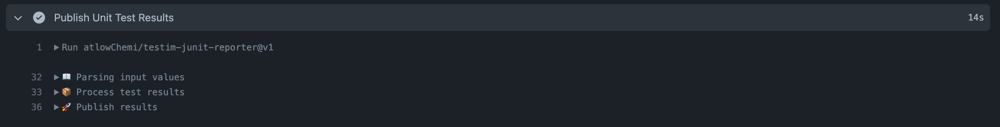

# testim-junit-reporter
Reports Testim JUnit test results as GitHub Actions checks

# Features

# Usage

# Contributing

Contributions are welcome! Please see [Contributing](CONTRIBUTING) for details.

# License

The scripts and documentation in this project are released under the [MIT License](LICENSE)
